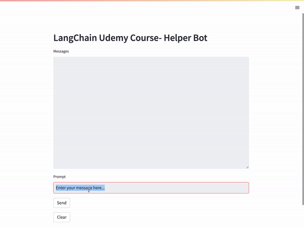

# 🦜 LangChain Documentation Helper

<div align="center">

**An intelligent documentation assistant powered by LangChain and vector search**

<p align="center">
  
  
</p>

<br>

[](https://www.python.org/downloads/)
[](https://langchain.com/)
[](https://streamlit.io/)
[](https://pinecone.io/)
[](https://app.tavily.com/home?utm_campaign=eden_marco&utm_medium=socials&utm_source=linkedin)
[](LICENSE)

[](https://www.udemy.com/course/langchain/?couponCode=LANGCHAINCD8C0B4060)

</div>

## 🎯 Overview

The **LangChain Documentation Helper** is a sophisticated AI-powered web application that serves as a slim version of [chat.langchain.com](https://chat.langchain.com/). This intelligent documentation assistant provides accurate answers to questions about LangChain documentation using advanced Retrieval-Augmented Generation (RAG) techniques, enhanced with web crawling capabilities and conversational memory.

### ✨ Key Features

**RAG Pipeline Flow:**

1. 🌐 **Web Crawling**: Real-time web scraping and content extraction using Tavily's advanced crawling capabilities
2. 📚 **Document Processing**: Intelligent chunking and preprocessing of LangChain documentation
3. 🔍 **Vector Storage**: Advanced embedding and indexing using Pinecone for fast similarity search
4. 🎯 **Intelligent Retrieval**: Context-aware document retrieval based on user queries
5. 🧩 **Memory System**: Conversational memory for coreference resolution and context continuity
6. 🧠 **Context-Aware Generation**: Provides accurate, contextual answers with source citations
7. 💬 **Interactive Interface**: User-friendly chat interface powered by Streamlit
8. 🚀 **Real-time Processing**: Fast end-to-end pipeline from query to response

## 🎬 Demo

<div align="center">
  
  <p><em>Interactive demo showing the LangChain Documentation Helper in action</em></p>
</div>

## 🛠️ Tech Stack

<div align="center">

| Component | Technology | Description |
|-----------|------------|-------------|
| 🖥️ **Frontend** | Streamlit | Interactive web interface |
| 🧠 **AI Framework** | LangChain 🦜🔗 | Orchestrates the AI pipeline |
| 🔍 **Vector Database** | Pinecone 🌲 | Stores and retrieves document embeddings |
| 🌐 **Web Crawling** | Tavily | Intelligent web scraping and content extraction |
| 🧩 **Memory** | Conversational Memory | Coreference resolution and context continuity |
| 🤖 **LLM** | OpenAI GPT | Powers the conversational AI |
| 🐍 **Backend** | Python | Core application logic |

</div>

## 🚀 Quick Start

### Prerequisites

- Python 3.8 or higher
- OpenAI API key
- Pinecone API key
- [Tavily API key](https://app.tavily.com/home?utm_campaign=eden_marco&utm_medium=socials&utm_source=linkedin) (required - for documentation crawling and web search)

### Installation

1. **Clone the repository**
   ```bash
   git clone https://github.com/emarco177/documentation-helper.git
   cd documentation-helper
   ```

2. **Set up environment variables**
   
   Create a `.env` file in the root directory:
   ```env
   PINECONE_API_KEY=your_pinecone_api_key_here
   OPENAI_API_KEY=your_openai_api_key_here
   TAVILY_API_KEY=your_tavily_api_key_here  # Required - for documentation crawling
   ```

3. **Install dependencies**
   ```bash
   pipenv install
   ```

4. **Ingest LangChain Documentation** (Run the ingestion pipeline)
   ```bash
   python ingestion.py  # Uses Tavily to crawl and index documentation
   ```

5. **Run the application**
   ```bash
   streamlit run main.py
   ```

6. **Open your browser** and navigate to `http://localhost:8501`

## 🧪 Testing

Run the test suite to ensure everything is working correctly:

```bash
pipenv run pytest .
```

## 📁 Project Structure

```
documentation-helper/
├── backend/                          # Core backend logic
│   ├── __init__.py
│   └── core.py
├── static/                           # Static assets (images, logos)
│   ├── banner.gif
│   ├── LangChain Logo.png
│   ├── Tavily Logo.png
│   ├── Tavily Logo Trimmed Padded.png
│   └── Trimmed Padded Langchain.png
├── chroma_db/                        # Local vector database
├── main.py                           # Streamlit application entry point
├── ingestion.py                      # Document ingestion pipeline
├── consts.py                         # Configuration constants
├── logger.py                         # Logging utilities
├── Tavily Demo Tutorial.ipynb        # 📚 Tutorial: Introduction to Tavily API
├── Tavily Crawl Demo Tutorial.ipynb  # 📚 Tutorial: Advanced Tavily crawling techniques
└── requirements files                # Pipfile, Pipfile.lock
```

### 📚 Tutorial Notebooks

The project includes comprehensive Jupyter notebooks that serve as hands-on tutorials:

- **`Tavily Demo Tutorial.ipynb`**: Introduction to Tavily API basics and core functionality
- **`Tavily Crawl Demo Tutorial.ipynb`**: Advanced tutorial covering Tavily's crawling capabilities, including TavilyMap and TavilyExtract features

These tutorials provide step-by-step guidance on integrating Tavily's powerful web search and crawling capabilities into your AI applications.

## 🔧 Configuration

### Environment Variables

| Variable | Description | Required |
|----------|-------------|----------|
| `PINECONE_API_KEY` | Your Pinecone API key for vector storage | ✅ |
| `OPENAI_API_KEY` | Your OpenAI API key for LLM access | ✅ |
| `TAVILY_API_KEY` | Your Tavily API key for documentation crawling and web search | ✅ |

## 🤝 Contributing

Contributions are welcome! Please feel free to submit a Pull Request. For major changes, please open an issue first to discuss what you would like to change.

## 📚 Learning Resources

This project is designed as a learning tool for understanding:
- 🦜 LangChain framework implementation
- 🔍 Vector search and embeddings
- 💬 Conversational AI development
- 🏗️ RAG (Retrieval-Augmented Generation) architecture

## 📄 License

This project is licensed under the MIT License - see the [LICENSE](LICENSE) file for details.

## 🌟 Support

If you find this project helpful, please consider:
- ⭐ Starring the repository
- 🐛 Reporting issues
- 💡 Contributing improvements
- 📢 Sharing with others

---

<div align="center">

### 🔗 Connect with Me

[](https://www.udemy.com/course/langchain/?referralCode=D981B8213164A3EA91AC)
[](https://www.linkedin.com/in/eden-marco/)
[](https://twitter.com/EdenEmarco177)

**Built with ❤️ by Eden Marco**

</div>
